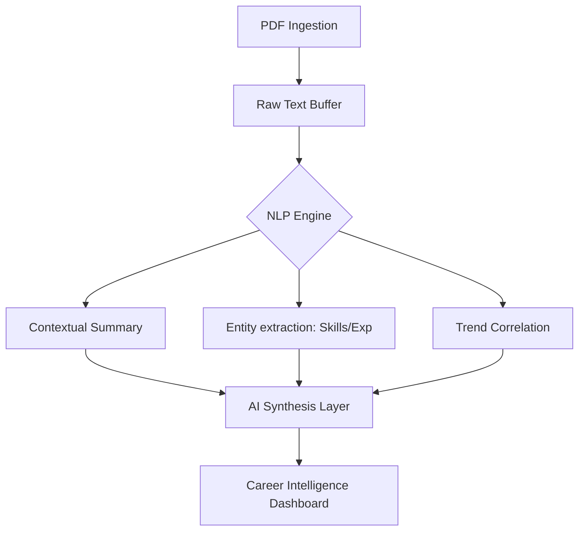

  

# 🧠 SkillMatch AI: Neural Resume Intelligence 🚀

---

### 🔍 Analysis Protocol: Deep Neural Extraction
This project is an **Advanced AI-Powered Resume Analysis Suite** that leverages Large Language Models (LLMs) and heuristic NLP patterns to decode "Career DNA". It understands professional context, identifies skill clusters, and projects future career trajectories.

---

## 🛠️ Machine Learning Infrastructure

  

- **🤖 LLM Core**: Integrated high-context probabilistic reasoning and semantic analysis.
- **📄 NLP Pipeline**: Multi-phase extraction process:
  1. **Binary Ingestion**: PDF byte-stream extraction.
  2. **Tokenization**: Context-aware segmentation of raw character streams.
  3. **Entity Recognition**: Identification of technical skillsets and domain hierarchies.
  4. **Heuristic Evaluation**: Semantic comparison against trending industry tech stacks.

---

## 🚀 Key Functional Modules

### 1. 🩸 Career DNA Summary
Generates a high-dimensional strategic summary of the candidate's professional identity.

### 2. ⚡ Neural Strength Identification
Detects core technical competencies often missed by traditional "keyword-matching" ATS systems.

### 3. 📉 Tech-Stack Correction
Identifies legacy patterns and suggests modern "Super-Skills" to bridge the gap.

---

## 🤝 Contributing

We welcome contributions from the global AI/ML community! To contribute:

1.  **Fork** the repository.
2.  Create a new **Branch** (`git checkout -b feature/NeuralUpdate`).
3.  **Commit** your changes (`git commit -m 'Add Neural Layer'`).
4.  **Push** to the branch (`git push origin feature/NeuralUpdate`).
5.  Open a **Pull Request**.

Refer to the [CONTRIBUTING.md](CONTRIBUTING.md) (coming soon) for more details.

---

## 🧬 System Architecture

---

  
   
  <i>"Predicting the future by analyzing the data of the past."</i>

---

  

