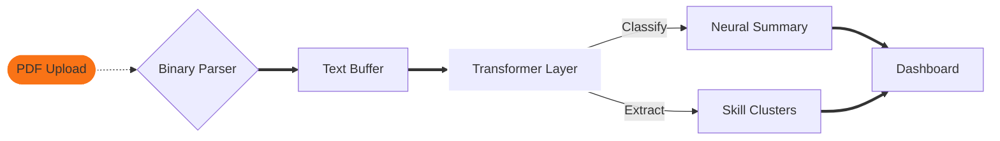

  

  
  

---

# 🤖 The Neural Career Protocol

SkillMatch AI is a **High-Dimension NLP Extraction Engine** designed to decode the latent technical DNA of professional profiles. It applies probabilistic synthesis to map career trajectories with extreme precision.

---

## 🔬 Core ML Infrastructure

### 📡 The Pipeline
1.  **Bitstream Ingestion**: Raw binary PDF data is parsed into normalized text buffers.
2.  **Semantic Tokenization**: Text is segmented into high-context tokens.
3.  **Entity Identification**: Deep-scan recognition of technical clusters.
4.  **Trend Correlation**: Cross-referenced against real-time industry technology spikes.

---

## 🤝 Contribution Gateway

| Protocol-Step | Action |
| :--- | :--- |
| **01. Ingestion** | `Fork` the main AI branch |
| **02. Synthesis** | `Commit` your neural enhancements |
| **03. Delivery** | Open a `Pull Request` |

---

## 🧬 System Topography

---

  

  <i>"System logic dictates the future. Sequence terminated."</i>
   
  

