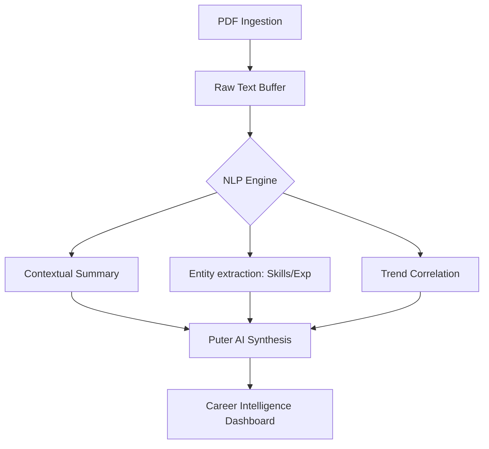

<p align="center">
  
</p>

# 🧠 SkillMatch AI: Neural Resume Intelligence 🚀

[](https://puter.com) 
[](https://en.wikipedia.org/wiki/Natural_language_processing)
[](https://github.com)

---

### 🔍 Analysis Protocol: Deep Neural Extraction
This project is an **Advanced AI-Powered Resume Analysis Suite** that leverages Large Language Models (LLMs) and heuristic NLP patterns to decode "Career DNA". It doesn't just read text; it understands professional context, identifies hidden skill clusters, and projects future career trajectories.

---

## 🛠️ Machine Learning Infrastructure

<div align="center">
  
</div>

- **🤖 LLM Core**: Integrated via **Puter.js** for high-context probabilistic reasoning and semantic analysis.
- **📄 NLP Pipeline**: Multi-phase extraction process:
  1. **Binary Ingestion**: PDF byte-stream extraction using `pdfjs-dist`.
  2. **Tokenization**: Context-aware segmentation of raw character streams.
  3. **Entity Recognition**: Identification of technical skillsets, experience durations, and domain hierarchies.
  4. **Heuristic Evaluation**: Semantic comparison of extracted entities against trending industry tech stacks.

---

## 🚀 Key Functional Modules

### 1. 🩸 Career DNA Summary
Generates a high-dimensional strategic summary of the candidate's professional identity using zero-shot classification patterns.

### 2. ⚡ Neural Strength Identification
Detects core technical competencies and leadership signals that are often missed by traditional "keyword-matching" ATS systems.

### 3. 📉 Tech-Stack Correction (Gap Analysis)
Compares the candidate's current skills against **Real-time Technological Trends**. It identifies legacy patterns and suggests modern "Super-Skills" to bridge the gap.

### 4. 🎯 Probabilistic Role Mapping
Predicts the top 5 most suitable career paths based on non-linear experience patterns and transferrable skills.

---

## 🧬 System Architecture



---

## ⚡ Quick Start

```bash
# Clone the repository
git clone https://github.com/SubashSK777/SkillMatch-AI_Resume_Analyzer.git

# Navigate to the frontend
cd frontend

# Install Dependencies
npm install

# Start the AI Engine
npm run dev
```

---

<p align="center">
  
  <br />
  <i>"Predicting the future by analyzing the data of the past."</i>
</p>

---

<p align="right">
  
</p>
