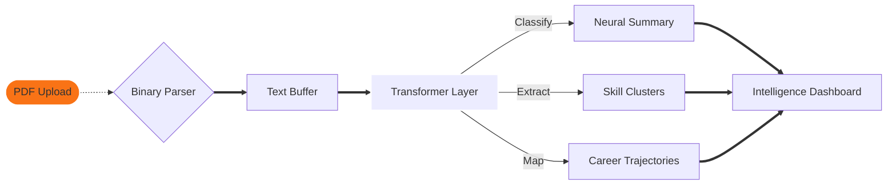

  

  
  
  

---

# 🤖 The Neural Career Protocol

SkillMatch AI is not a "pretty tool." It is a **High-Dimension NLP Extraction Engine** designed to decode the latent technical DNA of professional profiles. It treats resumes as multidimensional data vectors, applying probabilistic synthesis to map career trajectories with extreme precision.

---

## 🔬 Core ML Infrastructure

  

### 📡 The Pipeline
1.  **Bitstream Ingestion**: Raw binary PDF data is parsed into normalized text buffers.
2.  **Semantic Tokenization**: Text is segmented into high-context tokens to preserve professional intent.
3.  **Entity Identification**: Deep-scan recognition of technical clusters (e.g., PyTorch, CUDA, LLM, React).
4.  **Trend Correlation**: Resulting vectors are cross-referenced against real-time industry technology spikes.

---

## 🤝 Contribution Gateway

We are building the future of automated career intelligence. Contributions are mandatory for evolution.

| Protocol-Step | Action |
| :--- | :--- |
| **01. Ingestion** | `Fork` the main AI branch |
| **02. Processing** | Create a `feature/` or `fix/` branch |
| **03. Synthesis** | `Commit` your neural enhancements |
| **04. Delivery** | Open a `Pull Request` for review |

---

## 🧬 System Topography

---

  

  
   
  <i>"Probability is the only certainty."</i>

---

  

